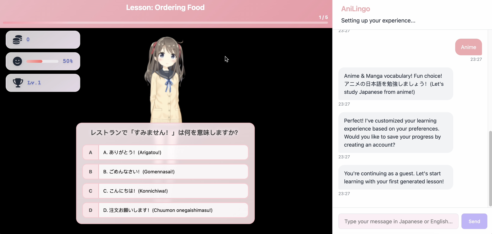

# AniLingo - Immersive Language Learning through AI Roleplay

AniLingo is an AI-powered web app that teaches Japanese through interactive conversations with anime-style virtual tutors. It adapts lessons to user interests, provides real-time feedback, and enhances engagement through character-driven roleplay.

## Features

- **Scenario-Based Learning**: Practice real-world situations like ordering food or shopping.
- **Adaptive Conversations**: AI responds to user mistakes, subtly correcting grammar and vocabulary.
- **Emotionally Responsive Characters**: Live2D avatars react dynamically to user progress.
- **Real-Time Feedback**: Context-aware grammar explanations and corrections.

## Demo

[](https://www.youtube.com/watch?v=VtvFDExPWaA)

## Tech Stack

- **Frontend**: React (Vite) with PixiLive2D for animations
- **AI Integration**: Custom-prompt LLM for adaptive teaching
- **Speech & Expression**: Fish Speech TTS & Live2D animations
- **Backend**: FastAPI with scenario management
- **Database**: PostgreSQL / Firestore (TBD)

## Installation & Setup

### Prerequisites
- **Node.js** (for frontend)
- **Python** (for backend)

### Frontend
```bash
cd front-end
npm install
npm run dev
```

### Backend
```bash
python -m venv venv
source venv/bin/activate  # Windows: venv\Scripts\activate
pip install -r requirements.txt
uvicorn main:app --reload
```

## API Endpoints

- **`POST /generate-lesson`** - Generate a personalized lesson
- **`POST /generate-lesson-new`** - Generate personalized lesson with audio files from tts
- **`POST /grammar-explanation`** - Provide grammar explanations
- **`GET /`** - Health check
